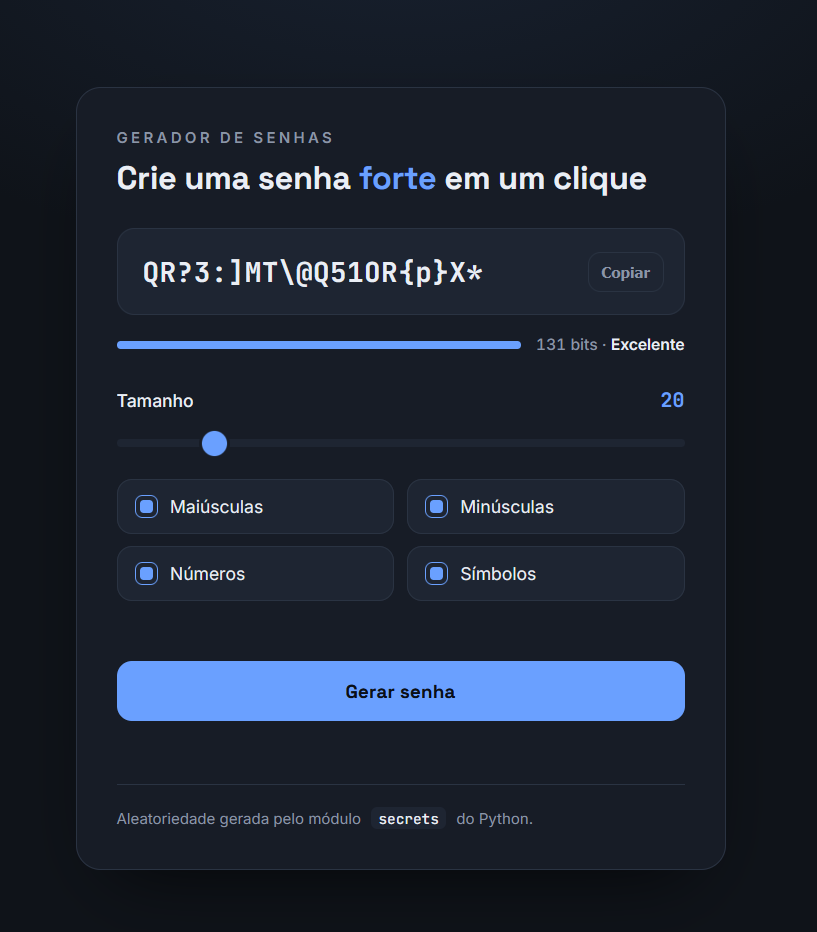

# Gerador de Senhas Seguras

Gerador de senhas fortes em Python, com interface web (Flask) e modo linha de comando. A aleatoriedade vem do módulo `secrets`, próprio para uso criptográfico.

## Prévia



## Recursos

- Aleatoriedade criptograficamente segura com `secrets`
- Interface web com opções de maiúsculas, minúsculas, números e símbolos
- Tamanho ajustável (mínimo de 12 caracteres)
- Garante ao menos um caractere de cada tipo selecionado
- Estimativa de força da senha em bits de entropia
- Copiar para a área de transferência em um clique
- Também funciona pela linha de comando
- Testes automatizados (`unittest`)
- Sem dependências além do Flask (o núcleo roda só com a biblioteca padrão)

## Requisitos

- Python 3.10 ou superior

## Como executar (interface web)

```bash
pip install -r requirements.txt
python app.py
```

Depois abra `http://127.0.0.1:5000` no navegador.

## Como executar (linha de comando)

O núcleo não depende do Flask:

```bash
python password_generator.py
```

Informe um tamanho igual ou superior a 12 quando solicitado.

## Como executar os testes

```bash
python -m unittest
```

## Estrutura

```
.
├── password_generator.py      # núcleo: geração, tamanho do alfabeto e entropia
├── app.py                     # interface web (Flask) reaproveitando o núcleo
├── templates/
│   └── index.html             # página do gerador
├── test_password_generator.py # testes
├── requirements.txt
└── .gitignore
```

## Sobre a segurança

Um gerador de senhas depende inteiramente da qualidade da aleatoriedade. Por isso o projeto usa `secrets`, e não o módulo `random` (que é previsível e não deve ser usado para fins de segurança). Os caracteres garantidos de cada tipo são embaralhados com `random.SystemRandom`, que também usa fonte segura do sistema operacional, para não expor a posição deles.
